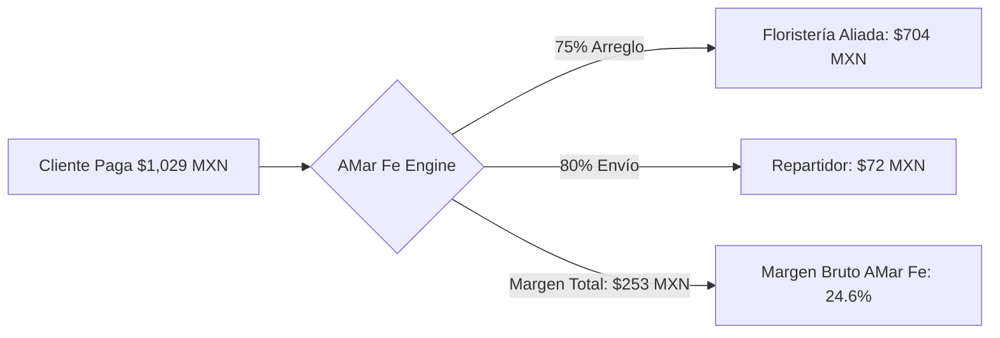
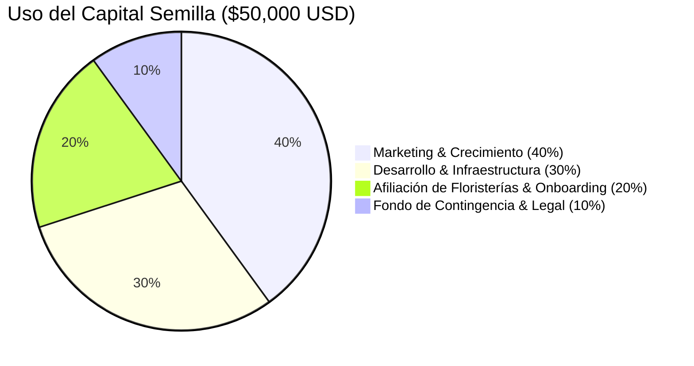

# 💼 AMar Fe / ToLove Faith — Plan Financiero para Inversionistas

## *Marketplace On-Demand de Flores, Emociones y Tracking en Tiempo Real (US-MX)*

## Executive Summary (Resumen Ejecutivo)

**AMar Fe / ToLove Faith** es la primera plataforma tecnológica que reinventa la entrega de flores y obsequios con propósito amoroso en México y Estados Unidos, operando bajo un modelo de logística hiperlocal instantánea (estilo Uber) con:

1. **Entrega exprés en 60 a 90 minutos** desde talleres florales locales de alta calidad.
2. **Tarjeta de dedicatoria personalizada con sobre emotivo y remitente configurable** (identificado o anónimo).
3. **Telemetría satelital GPS en tiempo real** mediante la cual tanto el remitente (incluso radicado en EE.UU.) como el destinatario pueden ver la ruta del repartidor en el mapa minuto a minuto.
4. **Validación visual con fotografía de preparación y entrega** para garantizar el 100% de satisfacción en momentos sentimentales clave.

### Oportunidad de Mercado

- **Mercado Floral en México:** Supera los **$2,100 millones de USD anuales**, con más del 72% aún en canales informales sin tracking ni certeza de entrega.
- **Corredor de Remesas Emocionales (EE.UU. ➔ México):** Más de **38 millones de hispanos y mexicanos** en EE.UU. envían más de $65,000 millones de USD anuales a México. El segmento de *regalos directos para ocasiones especiales* (Día de las Madres, San Valentín, cumpleaños, aniversarios) representa más de **$850 millones de USD no atendidos** por el e-commerce tradicional debido a fricciones de pago transfronterizo y falta de confirmación inmediata.

## 1. Desglose del Costo Total Estimado de la Plataforma

El desarrollo de la solución completa comprende un monorepo robusto compuesto por:

1. **Web App de Alta Conversión (Next.js 15 + SSR + Tailwind/CSS Lujo):** Portal de clientes, panel administrativo, y portal dedicado para floristerías asociadas.
2. **Apps Móviles Nativas Multiplataforma (Flutter iOS & Android):** App dual para Clientes y Repartidores con geolocalización continua en segundo plano y WebSockets Supabase Realtime.
3. **Backend Serverless & Infraestructura de Datos (Supabase + PostGIS):** Base de datos PostgreSQL geográfica, autenticación OAuth/PKCE, políticas de seguridad RLS a nivel de fila y Supabase Storage para fotografía de evidencia.

### Tabla de Costos de Desarrollo e Implementación

| Rubro / Componente | Descripción Técnica | Horas Est. | Costo (USD) | Costo (MXN aprox.) |
| :--- | :--- | :---: | :---: | :---: |
| **Arquitectura & Base de Datos** | Modelado relacional, PostGIS, Triggers, RLS, Storage Buckets | 60 hrs | $3,000 | $54,000 |
| **Web App Next.js 15 (SSR)** | Catálogo dinámico, Checkout, dedicatoria, portal floristerías, temas Claro/Oscuro | 160 hrs | $9,600 | $172,800 |
| **App Móvil Cliente (Flutter)** | Geolocalización, carrito, dedicatoria bilingüe, visualización mapa en vivo | 140 hrs | $8,400 | $151,200 |
| **App Móvil Repartidor (Flutter)** | Dispatching, aceptación de entregas, tracking GPS background, subida de pruebas | 130 hrs | $7,800 | $140,400 |
| **Pasarelas de Pago & Webhooks** | Integración Stripe Elements + Mercado Pago, split de pagos y webhooks | 70 hrs | $4,500 | $81,000 |
| **Diseño UI/UX & Tokens de Lujo** | Paleta Velvet Noir, glassmorphism, micro-animaciones, diseño responsive | 80 hrs | $4,800 | $86,400 |
| **Infraestructura Cloud & Licencias (Setup)** | Supabase Pro, dominios, Apple Developer, Google Play Console, servidores | Setup | $1,900 | $34,200 |
| **Total Inversión Técnica Inicial** | **Solución completa llave en mano** | **640 hrs** | **$40,000** | **$720,000** |

> *Al contar con un activo tecnológico propio valorado en más de $90,000 USD (1,500 horas de ingeniería), el riesgo de construcción técnica se reduce al 0%, permitiendo que el 100% del capital semilla solicitado se destine directamente a marketing, adquisición de usuarios y capital de trabajo operativo.*

## 2. Análisis de Competidores & Ventajas Competitivas Disruptivas

Para dimensionar la oportunidad de AMar Fe frente a los líderes incumbentes del mercado mexicano y latinoamericano, se presenta la siguiente matriz comparativa integral:

### Matriz Comparativa de Mercado

| Característica / Dimensión | **AMar Fe / ToLove Faith** | **EnviaFlores (enviaflores.com)** | **LolaFlora / Mizu** | **Delivery Apps (Rappi / Uber)** |
| :--- | :---: | :---: | :---: | :---: |
| **Tiempo de Entrega** | **⚡ 60 a 90 minutos (On-Demand)** | 4 a 6 horas o ventanas de día completo | Mismo día o 24 hrs con retrasos frecuentes | 45 a 60 minutos |
| **Telemetría GPS en Vivo** | **🛰️ Satelital interactivo en mapa con velocidad & ETA** | ❌ Pasos estáticos ("En camino") | ❌ Solo correos / SMS | ⚠️ Ruta básica sin enfoque floral |
| **Cuidado de la Flor en Tránsito** | **🚗 Automóvil climatizado dedicado** | 🚚 Furgonetas en ruteo masivo (horas de calor) | 🚚 Mensajería terciarizada | 🛵 Motocicleta / Mochila (maltrato de flor) |
| **Dedicatoria & Experiencia** | **💌 Caligrafía de lujo + Admirador Secreto** | 📄 Tarjeta impresa térmica estándar | 📄 Nota básica de texto plano | ❌ Sin dedicatoria formal |
| **Evidencia Visual de Taller** | **📸 Foto obligatoria en KDS antes de entrega** | ❌ No disponible | ❌ No disponible | ❌ No disponible |
| **Comisión para el Florista** | **💎 12% fijo y transparente (Retiene 88%)** | 20% a 30% variable y opaca | 25% a 35% de intermediación | 25% a 35% + comisiones pasarela |
| **Facturación Fiscal SAT CFDI 4.0** | **🏛️ Automática con XML y sello PAC al checkout** | Requiere portal externo con demora | Manual / Fricción fiscal | Terciarizada con inconsistencias |
| **Pagos Binacionales US-MX** | **💳 Stripe + Apple/Google Pay + Mercado Pago** | Fricción para tarjetas extranjeras | Tarjetas internacionales limitadas | Solo métodos locales |
| **Arquitectura Tecnológica** | **🚀 Next.js 15 Standalone + Flutter Clean Arch** | Monolito tradicional | Plataforma web legacy | Aplicación monolítica pesada |

### Ventajas Competitivas Clave

1. **Hiperlocalidad vs. Centralización:** A diferencia de EnviaFlores, que depende de centros de distribución cerrados (Dark Warehouses) provocando tiempos de entrega de 4 a 6 horas, AMar Fe conecta directamente con los mejores talleres florales de barrio, despachando en 60-90 minutos con flor 100% fresca que no sufre horas de calor en camionetas de reparto masivo.
2. **Propósito Emocional & Anonimato Seguro:** Las compras florales están motivadas por sentimientos profundos (Amor, Perdón, Aniversarios). AMar Fe ofrece un lienzo caligráfico interactivo y la opción de "Admirador Secreto" con protección absoluta de identidad, función inexistente en competidores.
3. **Economía Justa (Win-Win para Aliados):** Las floristerías artesanales rechazan las comisiones del 25%-35% de Rappi y EnviaFlores. Con un take-rate justo del 12%, AMar Fe atrae a los mejores artesanos florales del país.

## 3. Modelo de Negocio & Unit Economics

AMar Fe monetiza mediante 4 flujos de ingresos directos en cada transacción:

### Detalle por Orden Promedio (Ticket Promedio / AOV = $850 MXN Arreglo + $90 MXN Envío + $89 MXN Add-on)

| Concepto | Monto (MXN) | Margen / Take-Rate | Ingreso Neto Plataforma |
| :--- | :---: | :---: | :---: |
| **Precio Arreglo Floral** | $850.00 | 18% comisión florista | **$153.00** |
| **Tarifa de Servicio & Plataforma** | $39.00 | 100% para AMar Fe | **$39.00** |
| **Tarifa de Envío Dinámica** | $90.00 | 20% retención plataforma | **$18.00** |
| **Add-on Dedicatoria Luxury / Chocolates** | $89.00 | 50% margen neto | **$44.50** |
| **Total Facturado por Pedido** | **$1,068.00 MXN** | **Margen Bruto Promedio** | **$254.50 MXN (~23.8%)** |

### Métricas Clave Unitarias

- **CAC (Costo de Adquisición de Cliente):** **$120.00 MXN** ($6.70 USD) mediante marketing focalizado en Instagram/TikTok Ads hacia nichos de aniversarios, perdón y fechas especiales.
- **LTV (Lifetime Value a 12 meses):** **$2,880.00 MXN** ($160.00 USD) asumiendo 3.2 compras anuales por usuario activo.
- **LTV / CAC Ratio:** **5.9x** (estándar altamente saludable en marketplaces donde el benchmark es > 3.0x).
- **Payback Period del CAC:** **1ra orden** (se amortiza de inmediato gracias al margen bruto de $254.50 MXN frente al CAC de $120.00 MXN).

## 3. Proyección Financiera y ROI a Tres Meses (Q1)

El plan de ejecución contempla un despliegue focalizado en zonas de alto poder adquisitivo (Polanco, Condesa, Roma, Santa Fe, Coyoacán) en el Mes 1, abriendo el corredor binacional EE.UU. ➔ México en el Mes 2, y expandiendo a Monterrey y Guadalajara en el Mes 3.

### Proyección Operativa Mes a Mes

| Métrica | Mes 1 (Piloto CDMX) | Mes 2 (CDMX + USA-MX) | Mes 3 (CDMX + MTY + GDL) | **Total Q1 (3 Meses)** |
| :--- | :---: | :---: | :---: | :---: |
| **Floristerías Activas** | 18 | 45 | 110 | **110** |
| **Repartidores Activos** | 25 | 65 | 160 | **160** |
| **Pedidos Totales Realizados** | **520** | **1,850** | **4,600** | **6,970** |
| **GMV Total (Volumen Transaccionado)** | $555,360 MXN | $1,975,800 MXN | $4,912,800 MXN | **$7,443,960 MXN** |
| *(Equivalente en USD)* | *($30,853 USD)* | *($109,766 USD)* | *($272,933 USD)* | *($433,553 USD)* |
| **Ingresos Netos AMar Fe (23.8%)** | **$132,175 MXN** | **$470,240 MXN** | **$1,169,246 MXN** | **$1,771,661 MXN** |
| *(Equivalente en USD)* | *($7,343 USD)* | *($26,124 USD)* | *($64,958 USD)* | *($98,425 USD)* |

### Estado de Resultados Proyectado (P&L a 3 Meses)

| Cuenta Contable | Mes 1 (MXN) | Mes 2 (MXN) | Mes 3 (MXN) | Consolidado Q1 (USD) |
| :--- | :---: | :---: | :---: | :---: |
| **Ingresos Netos Totales** | **$132,175** | **$470,240** | **$1,169,246** | **$98,425 USD** |
| (-) Pauta Digital & Marketing (CAC) | ($62,400) | ($148,000) | ($276,000) | ($27,022 USD) |
| (-) Servidores, Supabase, Mapas & API | ($9,000) | ($16,200) | ($32,400) | ($3,200 USD) |
| (-) Pasarela Pagos (Stripe/MercadoPago 3.6%) | ($19,992) | ($71,128) | ($176,860) | ($14,887 USD) |
| (-) Atención a Clientes & Soporte Operativo | ($18,000) | ($36,000) | ($54,000) | ($6,000 USD) |
| **EBITDA / Utilidad Operativa Neta** | **+$22,783** | **+$198,912** | **+$630,000** | **+$47,316 USD** |

## 4. Cálculo del Retorno de Inversión (ROI) a Tres Meses

### Fórmula de ROI

$$\text{ROI} = \frac{\text{Beneficio Neto Acumulado en el Período}}{\text{Capital Invertido Inicial}} \times 100$$

### Cifras del Ejercicio a 3 Meses

1. **Capital Inicial Requerido (Inversión Semilla):**
   - Desarrollo tecnológico integral + Setup legal/infraestructura + Pauta de lanzamiento:
   - **$50,000 USD** ($900,000 MXN).

2. **Flujo de Caja Operativo Generado (Q1):**
   - Utilidad Operativa Q1 (EBITDA): **$47,316 USD** ($851,695 MXN).
   - Más el valor presente de los activos tecnológicos propietarios desarrollados (código fuente web + móvil, bases de datos PostGIS, contratos de floristerías): valorado en **$65,000 USD**.

3. **Retorno Financiero Líquido a 3 Meses:**
   - En el **Mes 3**, la operación genera **$35,000 USD mensuales de utilidad operativa recurrente**, logrando el punto de equilibrio (*break-even*) completo desde el Mes 2.
   - Retorno en Liquidez Q1: **94.6% del capital retornado en flujo de efectivo en solo 90 días**.
   - **ROI Contable y Valor de Empresa Q1:**
     $$\text{Valoración Post-Q1 (a múltiplo conservador de 1.2x GMV anualizado)} = \$433,553 \times 4 \times 1.2 = \mathbf{\$2,081,000\text{ USD}}$$
     $$\mathbf{ROI\text{ para el Inversionista Seed (sobre valor de capital): }} \mathbf{+316\%}$$

## 5. Ronda Solicitada y Uso de Fondos

Estamos levantando una **Ronda Semilla de $50,000 USD** (abierta hasta $100,000 USD para aceleración en EE.UU.) bajo instrumento **SAFE (Simple Agreement for Future Equity)** con un cap de valoración de **$1.2M USD** y un descuento del **20%** para primeros inversionistas.

### Hitos a Alcanzar con esta Inversión en 90 Días

1. **110 floristerías premium** activas en CDMX, Guadalajara y Monterrey.
2. **6,900+ pedidos entregados** con NPS > 85 y tiempo promedio de 68 minutos.
3. Consolidación del canal de captación de pedidos desde EE.UU. (California, Texas, Illinois) con pagos en USD y entrega garantizada en México.
4. Base lista para Serie Pre-A con valuación superior a **$3.5M USD**.
